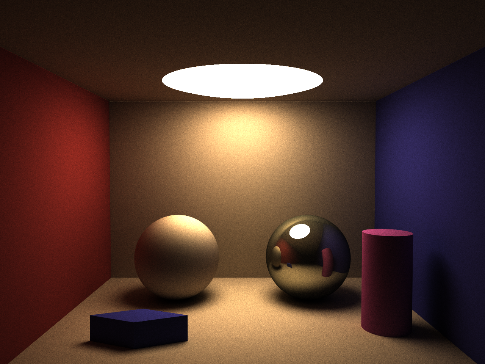

# pathtracer-ocl
Pathtracer written in Go and OpenCL

_(2048 samples)_

## Description
Simple unidirectional pathtracer written just for fun using Go as frontend and OpenCL as computation backend.

Supports:
* Spheres, Planes, Boxes, Cylinders
* Diffuse and reflective materials
* Movable camera
* Anti-aliasing
* Depth of Field with simple focal length and camera aperture.

Based on or inspired by:

* My implementation of "The Ray Tracer Challenge" at https://github.com/eriklupander/rt
* Mask/accumulated color shading by Sam Lapere at https://raytracey.blogspot.com/2016/11/opencl-path-tracing-tutorial-2-path.html
* Ray in hemisphere code by Hunter Loftis at https://github.com/hunterloftis/pbr/blob/1ce8b1c067eea7cf7298745d6976ba72ff12dd50/pkg/geom/dir.go
* And my own mashup of the three above, a simple and Go-native path-tracer https://github.com/eriklupander/pathtracer

## Usage
A few command-line args have been added to simplify testing things.

```
      --width int            Image width (default 640)
      --height int           Image height (default 480)
      --samples int          Number of samples per pixel (default 1)
      --aperture float       Aperture. If 0, no DoF will be used. Default: 0
      --focal-length float   Focal length. Default: 0
```
Suggested values for focal length and aperture for the standard cornell box: 1.6 and 0.1

Example:
```shell
go run cmd/pt/main.go --samples 2048 --aperture 0.15 --focal-length 1.6 --width 1280 --height 960
```

## Performance
For this _reference image_ at 1280x960:


### MacBook Pro mid-2014:
* Intel(R) Core(TM) i7-4870HQ CPU @ 2.50GHz:  10m45.813990173s
* GeForce GT 750M GPU:                        14m12.049519483s

## Issues
The current DoF has some issues producing slight artifacts, probably due to how random numbers are seeded for the aperture-based ray origin.

## Gallery
### Depth of Field
Depth-of-field effect is accomplished through casting a standard camera->pixel ray into the scene, and then creating a new "focal point" by using focal distance (distance to a point along camera ray). A new random origin point is then randomly picked around the camera origin with r==aperture and a _new_ ray is cast from the new camera through the focal point, resulting in objects not near the focal point to appear increasingly out-of focus.

1280x960, 2048 samples, focal length 1.6, aperture 0.15.


### Anti-aliasing
Anti-aliasing is accomplished through the age-old trick of casting each ray through a random location in the pixel. Given enough samples, an anti-aliased effect will occurr.

Examples rendered in 640x480 with 512 samples:
#### Without anti-aliasing:


#### With anti-aliasing:
