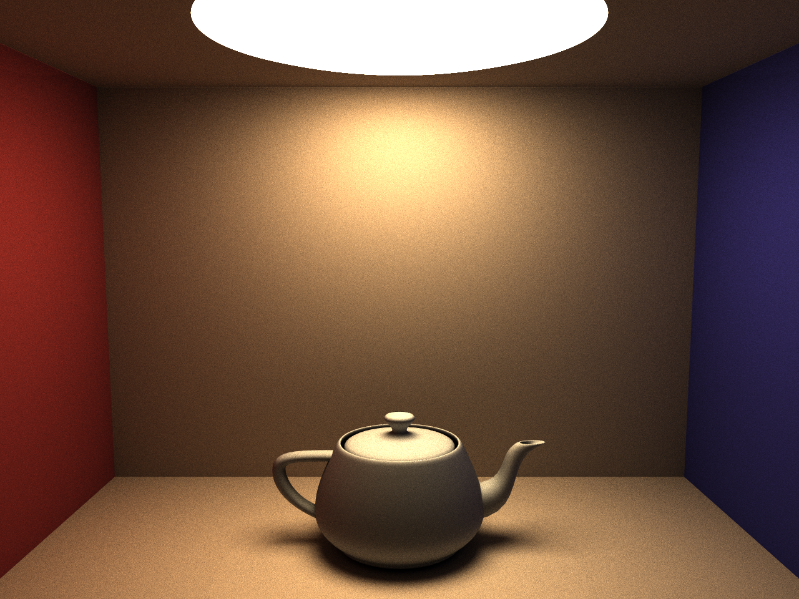

# pathtracer-ocl
Path tracer written in Go and OpenCL


_(2048 samples)_

## Description
Simple unidirectional pathtracer written just for fun using Go as frontend and OpenCL as computation backend.

Supports:
* Spheres, Planes, Boxes, Cylinders, Plain triangles
* Diffuse, refractive and reflective materials
* Movable camera
* Anti-aliasing
* Depth of Field with simple focal length and camera aperture.
* .OBJ model loading and rendering with BVH support, incl computing vertex normals.
* Texture-mapped planes, spheres and cubes.
* Textured environment spheres and cubes

Based on or inspired by:

* My implementation of "The Ray Tracer Challenge" at https://github.com/eriklupander/rt
* Mask/accumulated color shading by Sam Lapere at https://raytracey.blogspot.com/2016/11/opencl-path-tracing-tutorial-2-path.html
* Ray in hemisphere code by Hunter Loftis at https://github.com/hunterloftis/pbr/blob/1ce8b1c067eea7cf7298745d6976ba72ff12dd50/pkg/geom/dir.go
* And my own mashup of the three above, a simple and Go-native path-tracer https://github.com/eriklupander/pathtracer

## Usage
A few command-line args have been added to simplify testing things.

```
      --width int            Image width (default 640)
      --height int           Image height (default 480)
      --samples int          Number of samples per pixel (default 1)
      --aperture float       Aperture. If 0, no DoF will be used. Default: 0
      --focal-length float   Focal length. Default: 0
      --device-index int     Use OpenCL device with index (use --list-devices to list available devices)
      --list-devices         List available OpenCL devices
```
Suggested values for focal length and aperture for the standard cornell box: 1.6 and 0.1

Example:
```shell
go run cmd/pt/main.go --samples 2048 --aperture 0.15 --focal-length 1.6 --width 1280 --height 960
```

Note! The project probably only works on AMD64 CPUs since there's some leftover PLAN9 assembly generated from C AVX2 instrinsics, which is unlikely to work well on M1 Macs with ARM CPUs.

### Listing and selecting a device
Not all OpenCL devices are created equal. On the author's semi-ancient MacBook Pro 2014, running `go run cmd/pt/main.go --list-devices` yields:
```shell
Index: 0 Type: CPU Name: Intel(R) Core(TM) i7-4870HQ CPU @ 2.50GHz
Index: 1 Type: GPU Name: Iris Pro
Index: 2 Type: GPU Name: GeForce GT 750M
```
However, the Iris Pro iGPU does not support double-precision floating point numbers. Also, there are subtle differences between CPU and GPU device, which in certain situations may result in panics or segmentation faults. In other words: Your milage may vary. CPU-based devices seems to be the most stable and on MacBooks, CPU has significantly better performance than the discrete GPUs.

_Note: At some point, the path tracer stopped working on the **GeForce GT 750M**. Works fine on more modern GPUs..._

### Running on Windows
Given a nVidia GPU on Windows 10, a few env vars needs to be set. nVidia includes the OpenCL header and lib in their CUDA installation which by default seems to be installed at `C:\Program Files\NVIDIA GPU Computing Toolkit\CUDA\v11.5` which needs to be shortened. See example below:


```shell
set CGO_ENABLED=1
set CGO_CFLAGS=-I C:\PROGRA~1\NVIDIA~2\CUDA\v11.5\include
set CGO_LDFLAGS=-L C:\PROGRA~1\NVIDIA~2\CUDA\v11.5\lib\x64
go build cmd/pt/main.go
```

## Performance
For this _reference image_ at 1280x960:


### MacBook Pro mid-2014
* Intel(R) Core(TM) i7-4870HQ CPU @ 2.50GHz:  10m45.813990173s
* GeForce GT 750M GPU:                        14m12.049519483s

### MacBook Pro 2019
* Intel(R) Core(TM) i9-9880H CPU @ 2.30GHz:     4m20.568928052s
* AMD Radeon Pro 560X Compute Engine:           5m14.439406471s

### Desktop PC with Windows 10 - Ryzen 2600X
* NVIDIA GeForce RTX 2080:                      45.4309853s

_(AMD has dropped Ryzen CPU OpenCL support on Windows)_

In this scenario, the 8-core Core i9 CPU is more than twice as fast as the 4-cire Core i7 CPU on the older MacBook. Both mGPUs are slower than their respective CPUs.

The king is unsurprisingly enough the GeForce RTX 2080 on my Desktop PC, which is almost 6x faster than the 8-core Intel CPU.

### With 3D models
1280x960, 2048 samples.

#### Teapot
Intel(R) Core(TM) i7-4870HQ CPU @ 2.50GHz: 57m
NVIDIA GeForce RTX 2080, 256 wgsize: 47m
NVIDIA GeForce RTX 2080, 256 wgsize all lines in a single chunk: 29m20s. (Also, a few other optimizations had been done, especially regarding bounding box intersection testing)

#### Gopher
Intel(R) Core(TM) i7-4870HQ CPU @ 2.50GHz: ??? 
NVIDIA GeForce RTX 2080: 47m

Clearly, the GPU underperforms enormously with 3D model rendering. Gopher is about 16000 triangles, Teapot 6500 triangles. Both use BVH trees with semi-optimized group sizes.

Note that GPU usage (RTX2080) is 100% according to MSI Afterburner, so the GPU is doing all it can. It seems something is really inefficient though.

## Issues
--The current DoF has some issues producing slight artifacts, probably due to how random numbers are seeded for the aperture-based ray origin.--
Issue fixed after adding sunflower-based camera aperture sampling.
## Gallery
### Teapot
The classic. Here a 1280x960 render using 2048 samples:

_(Due to a single naive bounding box around all ~6500 triangles, rendering this image was extremely slow, about 7.5 hours on a MacBook Pro 2014)_. After adding a BVH with 500 triangles per node, the rendering went down to 1h42m. A render with about 75 triangles per node seems to be optimal in this scene, TBD full render!

### Depth of Field
Depth-of-field effect is accomplished through casting a standard camera->pixel ray into the scene, and then creating a new "focal point" by using focal distance (distance to a point along camera ray). A new random origin point is then randomly picked around the camera origin with r==aperture and a _new_ ray is cast from the new camera through the focal point, resulting in objects not near the focal point to appear increasingly out-of focus.

1280x960, 2048 samples, focal length 1.6, aperture 0.15.


### Lonesome window with Gopher and DoF

2048 samples. Combines a "window" with lengthened cornell box, reflective sphere and the Gopher model.

The window is made from an almost flat "light" cube with 4 cubes as window lining.

### Lonesome window with DoF

4096 samples. Bad use-case for brute-force path tracing. Similar to scene above, with Gopher and roof light removed.

### Anti-aliasing
Anti-aliasing is accomplished through the age-old trick of casting each ray through a random location in the pixel. Given enough samples, an anti-aliased effect will occurr.

Examples rendered in 640x480 with 512 samples:
#### Without anti-aliasing:


#### With anti-aliasing:


## Some tidbits on model rendering
The program now (march 2022) supports rendering .OBJ models as triangle groups structured into BVH trees. Given that recursion is forbidden in OpenCL, as well as variable-length arrays cannot be passed to OpenCL without careful management of struct sizes, "numberOfNN" fields etc, incorporating 3D model rendering with acceptable performance was non-trivial.

The overall solution:
* We have three types of "objects" that can be passed over to OpenCL
  * Objects. These are planes, spheres, cubes and cylinders, as well as "groups"
  * A group has a translation etc, but consists of 0-64 child subgroups, where each child subgroup typically is a partial mesh from an .OBJ file.
  * Each subgroup has a bounding box, may reference an arbitrary number of triangles and have 2 child subgroups. The subgroups form a binary tree. 
  * Triangles. All triangles for all models goes into a single array of triangles with pre-computed vertex normals, material color/emission and consume 512 bytes each.
  
A challenge here was that traversing the subgroup tree must be done using for-loops and a local "stack" rather than recursion.
 